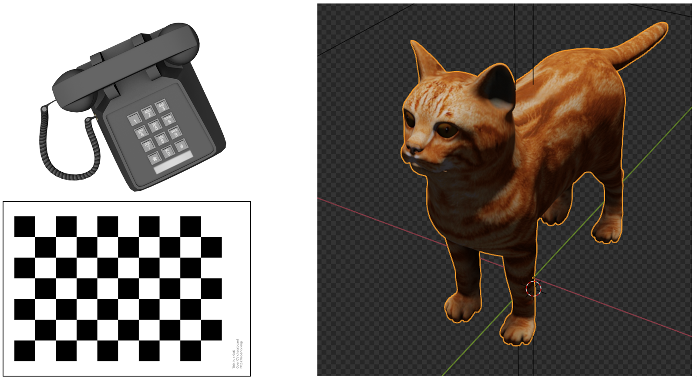
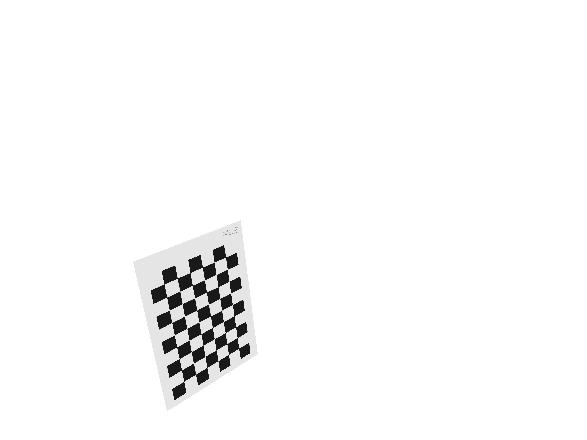
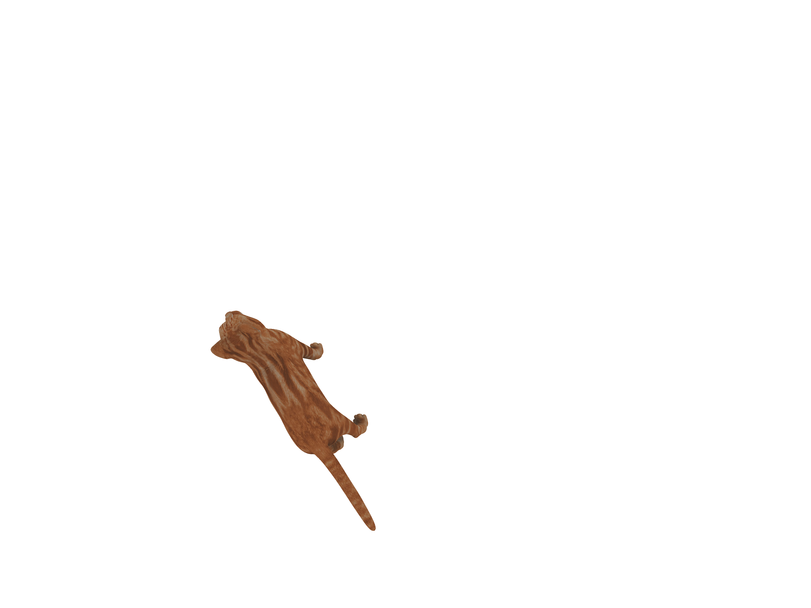
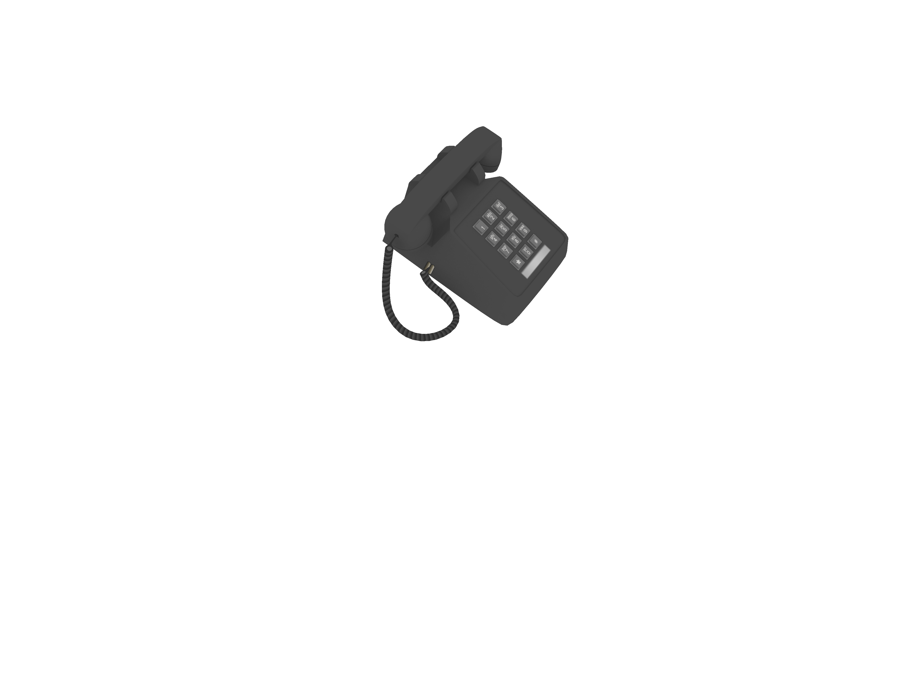

# 6D Pose Estimation with a known Object
Purdue University - CS 635 – Final project

## Motivation
Ultimately, we would like to get a 7 parameters camera calibration (focal length + 3 translations + 6 rotations) from a single image containing an object, whose 3D model is known. To achieve this goal, we start by estimating the 6D pose of a known object for camera calibration. This project does not include the code that transform a 6D pose into a camera matrix, but it should be straightforward to add if needed.

## Objects
We tried our pipeline on three objects: a calibration pattern, a cat and a phone.

## Pipeline
- Take a picture of an object, whose 3D model is known
- Manual segmentation of the object in the picture 
- Train a CNN to estimate the 6D pose with synthetic data
- Refinement of the pose using an image similarity measure

## Data representation
Data representation is critical and has a big influence on the ability of the network to learn. We are looking for a disentangled representation, which means that the parameters should have the least inter-dependences as possible.

For the object, we use a frame of reference aligned with the camera's frame. The center of rotation of the object is it's volumetric barycenter, so that we minimize the amount of tyhe object moving when rotating it.

For representing translations: we use perspective corrected coordinates. X=x/z, Y=y/z, z is the depth. It allows the network to learn X and Y based on a translation in the image pixel space. The depth can be estimated by the size of the object in the image.

For representing rotations: Euler angles can be ambiguous since they are periodic and can jump from 0° to 360°. Therefore, we use unit quaternions 

## Synthetic data generation
We use Blender to generate images of objects with random poses. We generate 40,000 images for the training set and 8,000 for the validation set. The resolution is 403 X 302 px, which is exactly 10 times less than the full resolution of a picture taken with a Google Pixel 3 phone. 

## Estimation of pose with a neural network
We use an architecture with 8 convolutional layers followed by two fully connected layers and finally a linear layer with 7 units for regressing the 6D pose (3 units for translations, 4 units for quaternions). Our network uses a total of 3,859,287 parameters. We train for 40 epochs, with an Adam optimizer, a batch size of 64 and the MSE loss. Training takes approximately 1 hour on a RTX 2080 GPU. To efficiently monitor the training, we output a set of custom metrics: average and maximum distance between prediction and ground truth (in meters); average and maximum smallest angle between prediction and ground truth (in radians).

After training, we get an average error of 0.19 rad (10°) and 17 mm. This is not as precise as we can get with a neural network, but definitely enough for an initial guess for our refinement step.

## Refinement
For refinement we developped a C++/OpenGL app. It optimizes the 6D pose of the object using a local unconstrained optmization algorithm. We optimize for silhouette overlapping, using the Dice coefficient and similarity of colors using MSE. To evaluate a pose, we render the object in OpenGL and compute the similarity measure directly in a compute shader. On average, refinement of the pose in one image takes 20 seconds.

## Results
We average the results on 100 test images. We show the average translation after estimation by the CNN and then after the refinement step. We also show two images: a reference pose to estimate, and the estimated pose using our pipeline. Try to look at both images one after another to see how different the two poses are.

### Calibration pattern
|                 | After CNN          |  After refinement |
|:----------------|-------------------:|------------------:|
| Avg translation | 0.033 m            | 0.006 m           |
| Avg rotation    | 0.270 rad (15.47°) | 0.048 rad (2.75°) |

Pattern reference pose

Pattern estimated pose

### Cat
|                 | After CNN          |  After refinement |
|:----------------|-------------------:|------------------:|
| Avg translation | 0.037 m            | 0.015 m           |
| Avg rotation    | 0.162 rad  (9.28°) | 0.085 rad (4.87°) |

Cat reference pose

Cat estimated pose

### Phone
|                 | After CNN          |  After refinement |
|:----------------|-------------------:|------------------:|
| Avg translation | 0.033 m            | 0.002 m           |
| Avg rotation    | 0.214 rad (12.26°) | 0.043 rad (2.46°) |

Phone reference pose

Phone estimated pose

## Future work
- Automatically segment a known object with a neural network
- Estimation
    - Improve the network architecture
    - Try a loss based on the reprojection of points on the mesh
    - Try to predict multiple different objects with the same network
- Try to improve the image similarity measure
    - Based on luminance for the pattern and the phone
    - Based on hue for the cat
- Try a global optimization algorithm constrained a small neighborhood around the estimated pose
- Try a differential renderer to directly compute the gradient instead of approximating it
- Output the camera matrices for calibration
- Adding the focal parameter for camera calibration

## Author
Mathieu Gaillard
[HPCG Laboratory](http://hpcg.purdue.edu/)  
Department of Computer Graphics Technology  
Purdue University
